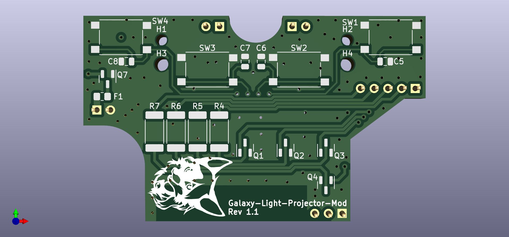
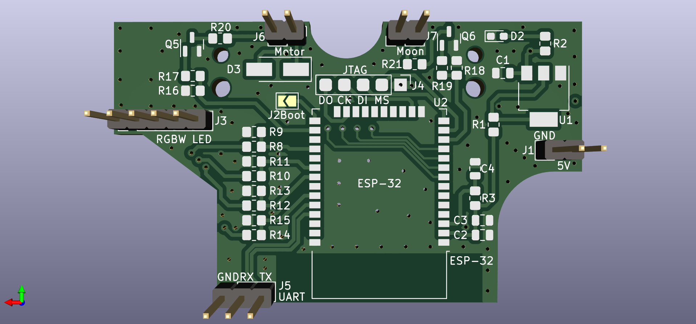
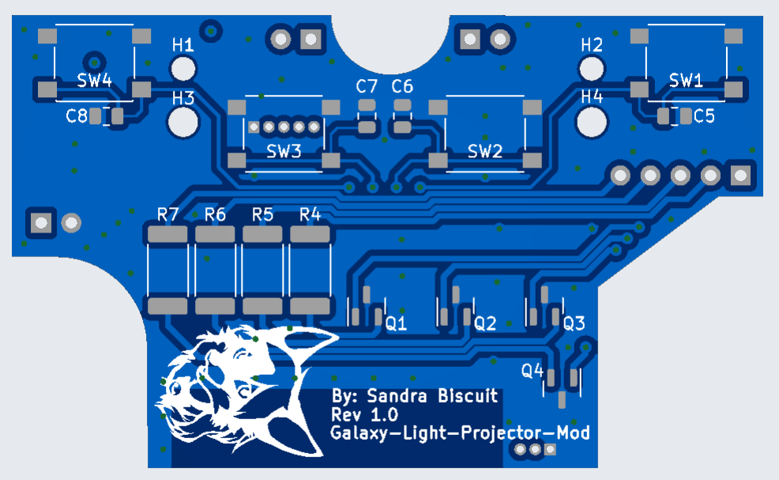
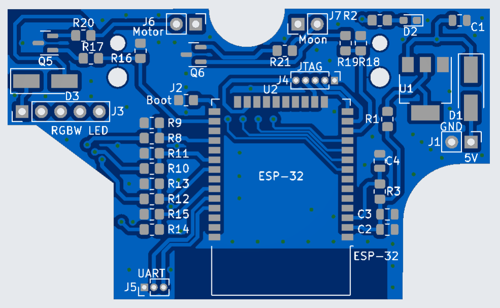
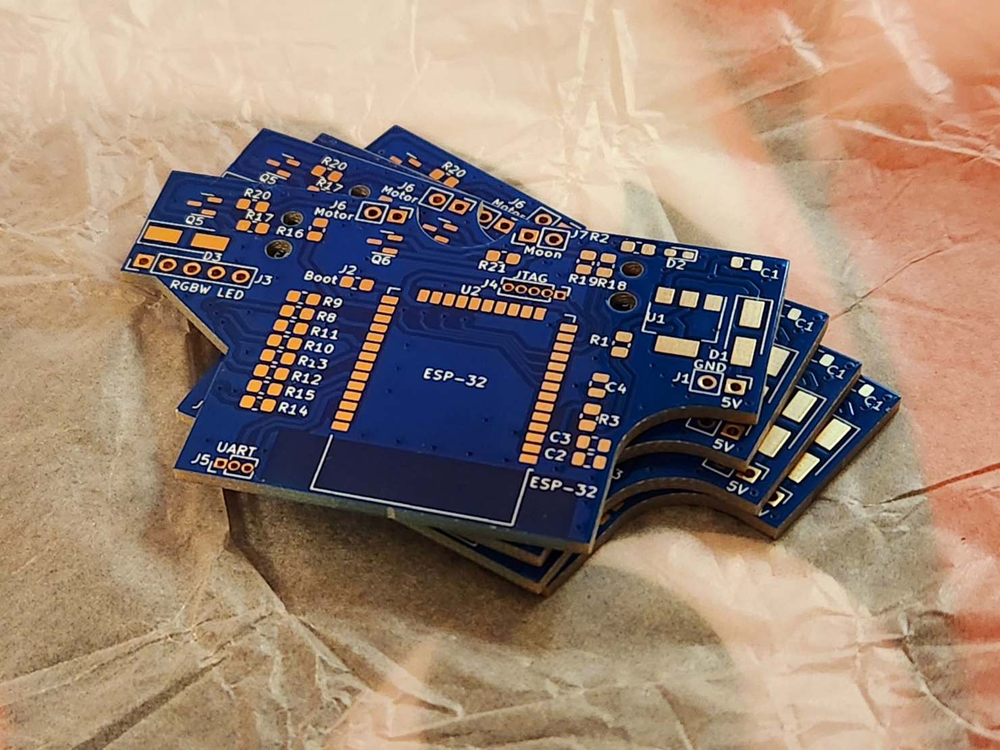
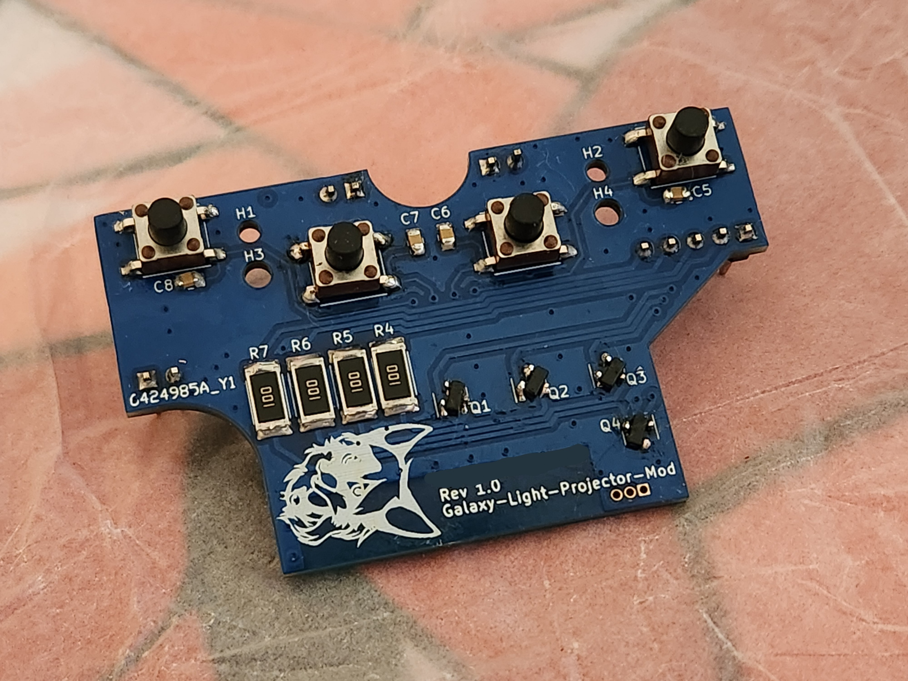
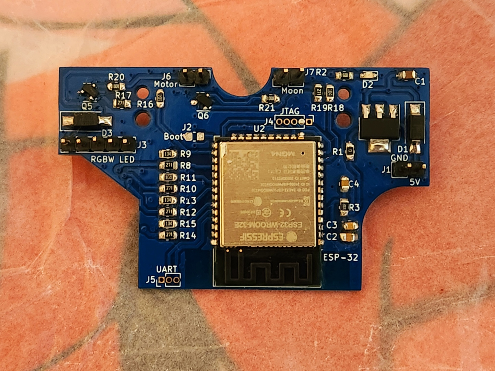

# Galaxy Light Projector Mod
Modification of a consumer night-light projector, converting it into a smart device with a custom PCB, powered by an ESP-32.

## Features
- Alexa integration
- Complex color patterns
- Improved brightness
- Better circuit protection

## Custom PCB

### KiCad Render (Rev. 1.1)
<table>
  <tr>
    <td>Front</td>
  </tr>
    <td></td>
  </tr>
  <tr>
    <td>Back</td>
  </tr>
  <tr>
    <td></td>
 </table>

 ### Fabrication Render (Rev. 1.0)
  <table>
    <tr>
      <td>Front</td>
    </tr>
      <td></td>
    </tr>
    <tr>
      <td>Back</td>
    </tr>
    <tr>
      <td></td>
    </table>

### Printed Circuit Board (Rev. 1.0)
<table>
  <tr>
    <td>Bare</td>
  </tr>
    <td></td>
  <tr>
    <td>Assembled Front</td>
  </tr>
    <td></td>
  </tr>
  <tr>
    <td>Assembled Back</td>
  </tr>
  <tr>
    <td></td>
 </table>