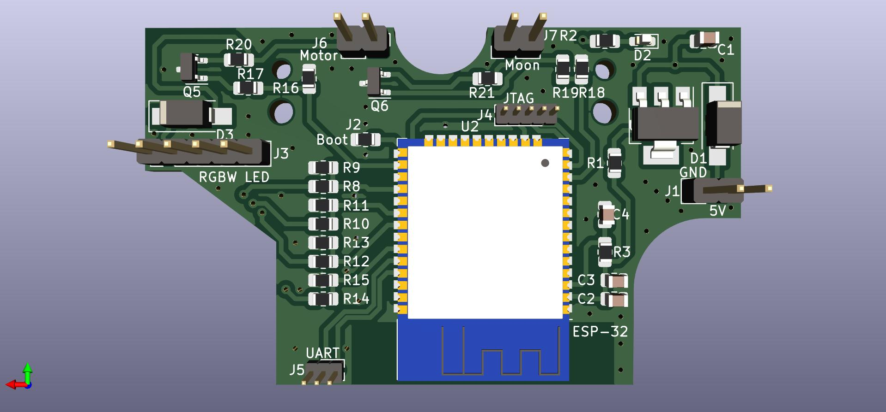

# Galaxy Light Projector Mod
Modification of a consumer night-light projector, converting it into a smart device with a custom PCB, powered by an ESP-32.

## Features
- Alexa integration
- Complex color patterns
- Improved brightness
- Better circuit protection

## Custom PCB
<table>
  <tr>
    <td>Front</td>
    <td>Back</td>
  </tr>
  <tr>
    <td></td>
    <td></td>
  </tr>
 </table>